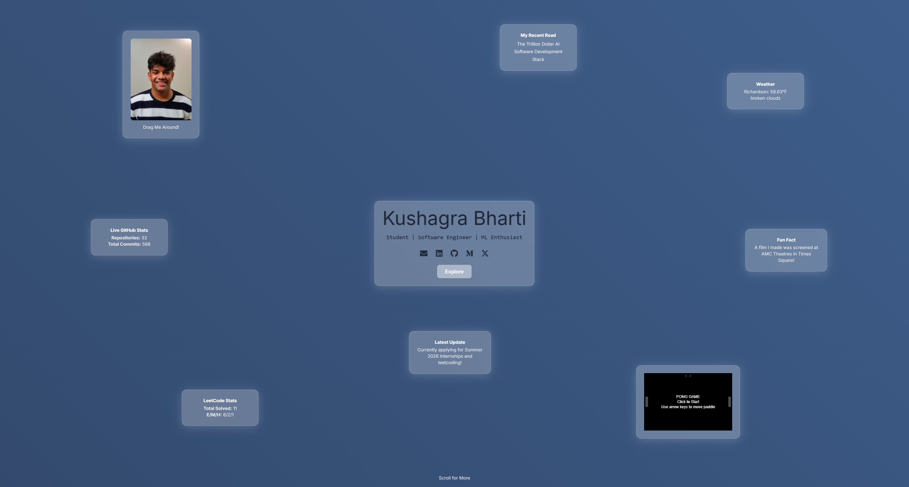

# Personal Portfolio Website

## Demo
[Live Site](https://www.kushagrabharti.com)

A dynamic, full-stack portfolio website to showcase my professional experience, education, and projects. This project features a responsive frontend built with React and TailwindCSS, a backend API built with Node.js and Express.js, and seamless integration for serving dynamic content.



## **Features**
- Interactive UI showcasing education, projects, and work experiences.
- Reusable and modular React components.
- Dynamic data served from a Node.js backend via RESTful APIs.
- Responsive design using TailwindCSS for modern styling.
- Stateful modals for detailed project and experience descriptions.
- Secure API communication with CORS middleware.

## **Tech Stack**
- **Frontend**: React, TypeScript, TailwindCSS, Vite
- **Backend**: Node.js, Typescript, Express.js
- **Deployment**: Vercel
- **APIs**: Axios for API communication

---

## **Getting Started**

### **Prerequisites**
- Node.js, npm, and yarn installed on your system
- Basic knowledge of JavaScript, TypeScript, and React

### **Setup**

#### Clone the repository:
```bash
git clone https://github.com/KushagraBharti/personal-portfolio.git
cd personal-portfolio
```

### Frontend Setup
```bash
cd frontend
bun install
```

### Ensure `frontend/.env.local` includes
```
VITE_API_BASE_URL=http://localhost:5000

# Supabase Config for Hidden Task Manager (can ignore)
VITE_SUPABASE_URL=
VITE_SUPABASE_ANON_KEY=
```

### Backend Setup
```bash
cd backend
bun install
Copy-Item .env.example .env
```

### Update `backend/.env` with values for
```
PORT=5000
GITHUB_USERNAME=
GITHUB_TOKEN=
LEETCODE_USERNAME=
OPENWEATHER_API_KEY=
GITHUB_STATS_TTL_MS=600000
```

## **Initializing Local Environment**

### Frontend Server
```bash
cd frontend
bun run dev
```

### Backend Server
```bash
cd backend
bun run dev
```
