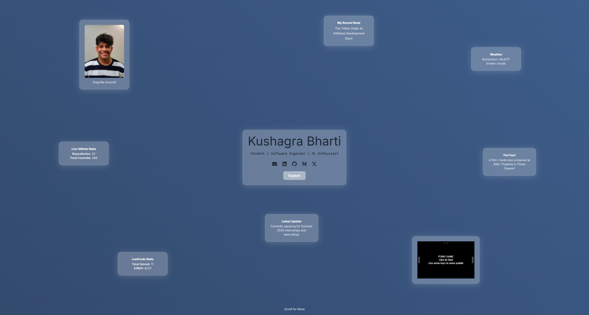

# Personal Site

[Live Site](https://www.kushagrabharti.com)

This is my full-stack personal site: a public portfolio built to feel alive, and a private tracker built for the way I actually work. The portfolio side is fast, animated, data-driven, and intentionally opinionated. The tracker side is a personal operating layer for tasks, workflow management, and calendar-connected planning. Both surfaces live in the same repository, with the backend acting as the canonical source for portfolio content and the frontend focused on presentation, interaction, and polish.



## Why This Site Is Cool

- The homepage is not a static landing page. It is an interactive stage with floating cards, live widgets, motion, and progressively loaded sections.
- The public portfolio is backend-authored, so projects, experiences, education, AI metadata, and site content stay synchronized across the UI, `/ai`, and `llms.txt`.
- The `/ai` route exposes a structured, machine-readable version of the site content for LLMs and agent workflows.
- The private tracker lives in the same codebase, with its own shell, module system, and backend route tree.
- Live GitHub, weather, and LeetCode integrations make the portfolio feel current instead of frozen in time.
- The repo is organized around two clear product surfaces, `portfolio` and `tracker`, rather than one giant mixed app.

## Features

- Interactive portfolio homepage with a staged hero, draggable cards, motion, and lazy-loaded long-form sections.
- Backend-owned portfolio content system for About, Intro, Education, Experiences, Projects, media metadata, and AI provider data.
- Canonical `/ai` page and generated `llms.txt` export sourced from the same backend snapshot pipeline.
- Stable slug-based public content records for projects, experiences, and education.
- Live GitHub stats with forced refresh behavior to avoid stale client-side values.
- Weather lookup routed through the backend, with Vercel geo headers used when available and a safe fallback path for local development.
- Private tracker shell with modular frontend sections for tasks, workflow/pipeline work, and calendar-connected planning.
- Split frontend/backend architecture that keeps public portfolio concerns separate from private tracker infrastructure.

## Tech Stack

- Frontend: React, TypeScript, Vite, Tailwind CSS, Framer Motion
- Backend: Express, TypeScript, Axios
- Data/Auth: Supabase
- Integrations: GitHub API, OpenWeather, LeetCode, Google Calendar
- Deployment: Vercel
- Tooling: Bun, ESLint, TypeScript

## Getting Started

### Prerequisites

- Bun
- A GitHub token if you want live GitHub stats
- An OpenWeather API key if you want the weather widget
- A LeetCode username if you want live LeetCode stats
- Supabase credentials if you want the private tracker to authenticate locally

### Clone

```bash
git clone https://github.com/KushagraBharti/Personal-Site.git
cd Personal-Site
```

### Frontend setup

```bash
cd frontend
bun install
cp .env.local.example .env.local
```

Populate `frontend/.env.local` with:

```bash
VITE_API_BASE_URL=http://localhost:5000

# Optional Supabase Config for Hidden Task Manager (can ignore)
VITE_SUPABASE_URL=
VITE_SUPABASE_ANON_KEY=
```

### Backend setup

```bash
cd backend
bun install
cp .env.example .env
```

Populate `backend/.env` with atleast:

```bash
GITHUB_USERNAME=
GITHUB_TOKEN=
LEETCODE_USERNAME=
OPENWEATHER_API_KEY=
```

### Run locally

Frontend:

```bash
cd frontend
bun run dev
```

Backend:

```bash
cd backend
bun run dev
```

### Production builds

Frontend:

```bash
cd frontend
bun run build
```

Backend:

```bash
cd backend
bun run build
```

## Notes

- This repo is Bun-only.
- `frontend/public/llms.txt` is generated from the backend export flow during frontend dev/build.
- The portfolio data source lives in `backend/src/portfolio/content`.
- The tracker is a private surface and expects Supabase-backed auth/config to be present.
